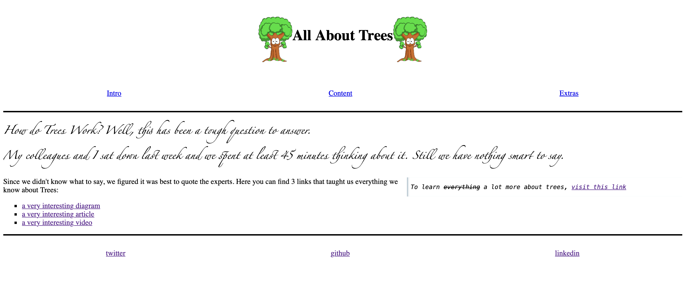

# All About Trees

> A straightforward landing page that provides comprehensive information about
> trees with helpful resources.

## Table of contents

- [Name of project](#name-of-project)
  - [Table of contents](#table-of-contents)
  - [General info](#general-info)
  - [Screenshots](#screenshots)
  - [Technologies](#technologies)
  - [Setup](#setup)
  - [Status](#status)
  - [Inspiration](#inspiration)
  - [Contact](#contact)
  - [Instructions for use](#instructions-for-use)
  - [Code Quality Checks](#code-quality-checks)
  - [Continuous Integration (CI)](#continuous-integration-ci)

## General info

> This project is to rebuild the
> [_All About Trees_](https://denepo.js.org/agile-development/deliverables/all-about-trees/index.html)
> site in a new repository as a group using the Planning and Collaborating
> workflows to learn and practice Agile methodology.

## Screenshots

## Technologies

- Node 18.16.0
- VSC code
- HTML
- CSS
- Git & GitHub

## Setup

- `npm run start`

## Status

Project is: _in progress_

## Inspiration

[_All About Trees_](https://denepo.js.org/agile-development/deliverables/all-about-trees/index.html)

## Contact

By [Tech Gang Team]

## Instructions for use

  
Getting Started

<!-- a guide to using this repository -->

1. `git clone https://github.com/Zakey-Pilot/html-css-project.git`
2. `cd html-css-project`
3. `npm install`

## Code Quality Checks

- `npm run format`: Makes sure all the code in this repository is well-formatted
  (looks good).
- `npm run lint:ls`: Checks to make sure all folder and file names match the
  repository conventions.
- `npm run lint:md`: Will lint all of the Markdown files in this repository.
- `npm run lint:css`: Will lint all of the CSS files in this repository.
- `npm run validate:html`: Validates all HTML files in your project.
- `npm run spell-check`: Goes through all the files in this repository looking
  for words it doesn't recognize. Just because it says something is a mistake
  doesn't mean it is! It doesn't know every word in the world. You can add new
  correct words to the [./.cspell.json](./.cspell.json) file so they won't cause
  an error.
- `npm run accessibility -- ./path/to/file.html`: Runs an accessibility analysis
  on all HTML files in the given path and writes the report to
  `/accessibility_report`

## Continuous Integration (CI)

When you open a PR to `main`/`master` in your repository, GitHub will
automatically do a linting check on the code in this repository, you can see
this in the[./.github/workflows/lint.yml](./.github/workflows/lint.yml) file.

If the linting fails, you will not be able to merge the PR. You can double check
that your code will pass before pushing by running the code quality scripts
locally.

